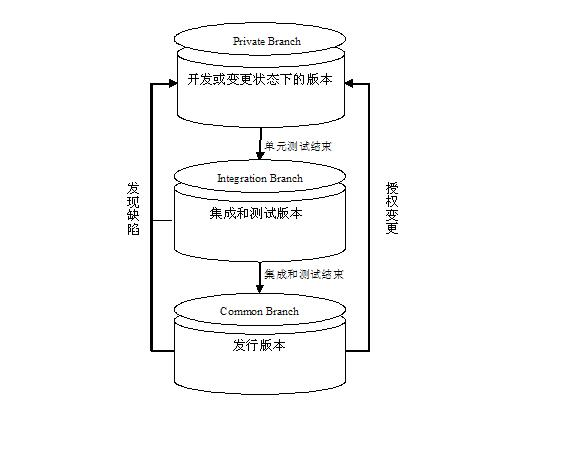
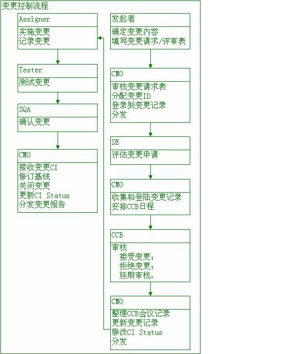

# 配置管理流程

## 1　概要

### 1.1　内容

规范配置管理活动，确保配置项正确地唯一标识并易于存取，保证基准配置项的更改受控，明确基线状态，在贯穿整个软件生命周期中建立和维护项目产品的完整性和可追溯性。

### 1.2　适用范围

对于不同类别的软件项目，配置管理的流程不同，可在本流程的基础上进行裁减。

### 1.3　术语和缩略语

#### 1.3.1　软件配置管理（Software Configuration Management，SCM）

软件配置管理是对软件修改进行标识、组织和控制的技术，用来协调和控制整个过程。是通过技术或行政手段对软件产品及其开发过程和生命周期进行控制、规范的一系列措施。配置管理的目标是记录软件产品的演化过程，确保软件开发者在软件生命周期中各个阶段都能得到精确的不同版本的产品配置。

#### 1.3.2　配置（Configuration）

配置是在技术文档中明确说明并最终组成软件产品的功能或物理属性。因此配置包括了即将受控的所有产品特性，其内容及相关文档、软件版本、变更文档、软件运行的支持数据，以及其他一切保证软件一致性的组成要素，相对与硬件类配置，软件产品的配置包括更多的内容并具有易变性。

#### 1.3.3　配置项（Configuration Item，CI）

凡是纳入配置管理范畴的工作成果统称为配置项（Configuration Item, CI），配置项逻辑上组成软件系统的各组成部分，一般是可以单独进行设计、实施和测试的。一个纯软件的CIs通常也称之为软件配置项（Computer Software Configuration Items，CSCIs）。

配置项主要有两大类：

1) 属于产品组成部分的工作成果，例如需求文档、设计文档、源代码、测试用例等；
2) 项目管理和机构支撑过程产生的文档。这些文档虽然不是产品的组成部分，但是值得保存。

每个配置项的主要属性有：名称、标识符、文件状态、版本、作者、日期等。所有配置项都被保存在配置库里，确保不会混淆、丢失。配置项及其历史记录反映了软件的演化过程。

#### 1.3.4　基线（Baseline）

在配置管理系统中，基线就是一个CI或一组CIs在其生命周期的不同时间点上通过正式评审而进入正式受控的一种状态，这些配置项构成了一个相对稳定的逻辑实体，而这个过程被称为“基线化”。每一个基线都是其下一步开发的出发点和参考点。基线确定了元素（配置项）的一个版本，且只确定一个版本。一般情况下，基线一般在指定的里程碑（Milestone）处创建，并与项目中的里程碑保持同步。每个基线都将接受配置管理的严格控制，基线中的配置项被“冻结”了，不能再被任何人随意修改，对其的修改将严格按照变更控制要求的过程进行，在一个软件开发阶段结束时，上一个基线加上增加和修改的基线内容形成下一个基线。

基线的主要属性有：名称、标识符、版本、日期等。通常将交付给客户的基线称为一个“Release”，为内部开发用的基线则称为一个“Build”。

建立基线的好处：

1) `重现性`：及时返回并重新生成软件系统给定发布版的能力，或者是在项目中的早些时候重新生成开发环境的能力。当认为更新不稳定或不可信时，基线为团队提供一种取消变更的方法。

2) `可追踪性`：建立项目工件之间的前后继承关系。目的是确保设计满足要求、代码实施设计以及用正确代码编译可执行文件。

3) `版本隔离`：基线为开发工件提供了一个定点和快照，新项目可以从基线提供的定点之中建立。作为一个单独分支，新项目将与随后对原始项目（在主要分支上）所进行的变更进行隔离。

## 2　相关人权责

### 2.1　项目经理（Project Manager，PM）

`责任：`

1) 与CCB协商确定项目起始基线和开发里程碑；
2) 接受配置管理计划，并按相关规定贯彻执行；
3) 接受配置控制委员会的报告。

`权利：`

1) 提出配置管理计划的修改要求；
2) 提出管理管理的建议和要求。

### 2.2　配置控制委员会（Configuration Control Board，CCB）

`责任：`

1) 制定和修改项目的配置管理策略；

`权利：`

1) 批准、发布配置管理计划；
2) 建立、更改基线的设置，审核变更申请；
3) 根据配置管理员的报告决定相应的对策。

### 2.3　配置管理员（Configuration Management Officer，CMO）

`责任：`

1) 编制配置管理计划；
2) 执行配置项管理方案；
3) 执行版本控制和变更控制方案；
4) 编制配置状态报告；

`权利：`

向CCB汇报有关配置管理流程中的不符合情况。

### 2.4　程序库管理员（Program Librarian，PL）

`责任：`

1) 配置库的建立和权限分配；
2) 配置管理工具的日常管理与维护；
3) 配置库的日常操作和维护；

`权利：`

1) 各配置项的管理与维护；
2) 对开发人员进行相关的培训。

### 2.5　开发人员（Developer）

`责任：`

1） 根据确定的配置管理计划和相关规定，提交配置项和基线；
2） 负责软件集成和版本生成。

`权利：`

按照软件配置管理工具的使用模型来完成开发任务。

### 2.6　测试人员（Tester）

`责任：`

根据配置管理计划和相关规定，提交测试配置项和测试基线；

`权利：`

负责软件变更的测试验证。

### 2.7　软件质量保证员（Software Quality Assurance，SQA）

`责任：`

负责配置审核并提交报告。

`权利：`

对配置审核中发现的不符合项，要求相关责任人进行纠正。

## 3　实施细则

### 3.1　CCB的成立

#### 3.1.1　项目在设计发注后，由项目经理负责组织成立CCB。

#### 3.1.2　CCB成员组成

CCB成员人数一般为奇数，人数在3～7人范围内。CCB成员一般包括：

1) 项目经理PM；
2) 配置管理员CMO；
3) SQA；
4) 测试人员Tester；
5) 顾客代表；
6) 主要开发人员等。

#### 3.1.3　CCB的决策机制

寻求CCB成员的一致意见。若不能达成一致，可采取由顾客代表做出决策；或采取少数服从多数的原则，由CCB成员投票确定，投票超过半数即为通过。

### 3.2　确定配置策略

#### 3.2.1　配置策略确定的时机

CCB成立后，由CCB组织会议根据项目的开发计划确定各个里程碑和开发策略，CMO负责整理确定的项目基线和配置项列表，并在编制《配置管理计划》时列明，按约定的时机收集配置项和建立初始基线。

#### 3.2.2　配置项的范围

1) `技术文档（Documents）`：项目开发计划、需求分析报告、软件设计书、质量保证计划、概要设计书、详细设计书、测试文档、技术报告、用户手册、总结报告等；
2) `程序（Program）`：阶段产品、计算机程序、源程序、释放产品等；
3) `工具（Tools）`：自动设计工具、开发工具、测试工具、维护工具等；

4) `交互文档（Communications）`：与客户或项目组内交互产生文档，如会谈记录、E-mail、会议纪要、MSN记录等。

### 3.3　制定配置管理计划

#### 3.3.1　《配置管理计划》的编制

通常情况下，由CMO在设计发注后，开始编制《配置管理计划》；如有特殊需要，根据合同或项目要求，由CMO在某一项目或项目的某一阶段开始前制定《配置管理计划》。

#### 3.3.2　《配置管理计划》的内容

《配置管理计划》应包括以下方面的内容：

1) 该项目对配置管理的要求；
2) 实施配置管理的责任人、组织及其职责；
3) 需要开展的配置管理活动及其进度安排；
4) 采用的方法和工具等。

#### 3.3.3　《配置管理计划》的由CCB负责审批。

### 3.4　配置项标识规则

#### 3.4.1　配置项标识要求

1) 合同有明确标识和追踪要求时，由开发人员按合同要求进行标识，以保证满足合同追踪要求。
2) 在开发过程中项目组人员提交的配置项，由项目组人员按照本节相关部分标识规则进行标识。
3) 项目组人员将要标识或已标识的配置项提交给CMO纳入配置库统一管理，并填写《配置状态报告》。

#### 3.4.2　配置项标识方式

##### 3.4.2.1　标识项

配置项标识属性包括：名称、编号、文件状态、版本、作者、日期等。本文标识规则对名称、编号、文件状态和版本进行了描述和规定。

##### 3.4.2.2　名称

文件名称的标识按文档模板中统一名称为准。

a) 编号

文档编号格式为  `CC_XXX_***_$$$_###`，其中 `CC`表示公司，`XXX`是项目的三位英文字母缩写表示， `***_$$$`表示文档类别，`###`表示文档顺序号。同时对应每个内容都有固定的一个索引文件`CC_XXX_**_$$$_index`，目的是为了为本类别下的文件建立一个概要说明列表，保证快速对文档进行识别和检索。

##### 3.4.2.3　文件状态

文件状态分为“草稿”、“正式发布”和“修改中”三种。

修改处于“草稿”状态的配置项不算是“变更”，无需CCB的批准，修改者按照版本控制规则执行即可。

当配置项的状态成为“正式发布”，或者被“冻结”后，此时任何人都不能随意修改，必须依据配置变更控制的规则执行。

##### 3.4.2.4　文档版本控制

对于计划性文档、技术文档和用户文档，其版本按修改的先后顺序确定。新生成的文档第一次发行为第一版，修改后第二次发行为第二版，以此类推。

##### 3.4.2.5　发行版本控制

最终完成的软件版本用三位符号表示：“s.x.y”。各符号位的含义如下：

1) “y”为第二次版本号，表示纠正错误时的版本升级，用一位数字表示：“1~9”，对上一次产品或项目中的缺陷做修正，第二次版本号增加；

2) “x”为第一次版本号，表示增加功能时的版本升级，用一位数字表示：“0~9”。与上一产品或项目相比，功能进行了小量的增加或修正时，第一次版本号增加，第二次版本号为零，第二版本号为零时可以省略不写；

3) “s”为主版本号。对产品作重大调整，或与已发行的上一产品相比，在功能与性能上有较大改善时主版本号增加；产品或项目概念全新，第一次完成，版本号为1.0。

##### 3.4.2.6　基线版本标识

内部基线，如计划基线、设计基线等，在版本号前加Build，如Build 1.0；

发行产品基线在版本号前加Release，如Release 2.0。

### 3.5　配置库管理

#### 3.5.1　配置库（Repository）的分类

`配置库分为两类：`

1) `文档库（Document Library）`：由CMO负责管理，主要使用eSM系统管理除程序以外的文档资料（包括图片等）；
2) `程序库（Program Library）`：由PL负责管理，主要使用CVS版本工具对程序代码进行管理。

#### 3.5.2　配置库的建立

1) CCB成立之后，PL即可着手组织建立配置库。所有项目应建立配置库，以便管理各配置项。
2) 文档库空间由eSM系统创建，PL仅创建基线文档库，仅PL可以对其操作。
3) 程序库主要通过设置版本的分支，来实现对配置项权限管理，基本上要为每个配置项从建立开始就划分成3个不同的分支（如图1）：

`图1　配置库空间分配和版本迁移策略`

1) `私有分支（Private Branch）`：私有分支对应的是开发人员的私有开发空间。开发人员根据任务分工获得对相应配置项的操作许可之后，他即在自己的私有开发分支上工作，他的所有工作成果体现为在该配置项的私有分支上的版本的推进，除该开发人员外，其他人员均无权操作该私有空间中的元素。

2) `集成分支（Integration Branch）`：集成分支对应的是开发团队的公共空间。凡是要为同组人员共享的配置项都从该分支获得。即各开发人员必须将私有工作空间中的开发成果归并（Merge）到该分支后才能进入下一个开发活动。所有涉及多人协调的开发工作（如集成测试等）都必须工作在这一空间中。该开发团队拥有对该集成分支的读写权限，而其他成员只有只读权限。该分支的管理工作由PL及相关指定人员负责。

3) `公共分支（Common Branch）`：公共分支对应的是整个软件开发组织的公共空间。各个开发小组在现阶段的任务完成后，将可以发布的版本归并到该分支上，将来需要查阅相关资料时，以该分支上的版本为准。该分支对组织内的全体软件人员开放只读权限。该分支的管理工作由PL负责。

上述定义的3类分支以及文档库由CMO统一管理，根据各开发阶段的实际情况定制相应的版本选取规则，来保证开发活动的正常运作。在变更发生时，应及时做好基线的推进。

#### 3.5.3　分配权限

PL为每个项目成员分配配置库操作权限。一般地，项目成员拥有Add、 Checkin/Checkout、Download等权限，但是不能拥有“删除”权限。PL的权限最高。

#### 3.5.4　配置库的操作与管理

1) 开发人员根据获得的授权的资源进行项目的研发工作，操作配置库，例如Add、Checkin/Checkout、Download等。
2) PL根据配置管理计划创建与维护基线，“冻结”配置项，控制变更。
3) 配置库的检出

当发生变更且变更评审通过后，或者发现Bug且Bug评审通过后，由PL将Common Branch中CIs检出至开发人员的Private Branch上，供开发人员进行变更。

4) 配置库的检入

当变更实施结束或Bug修正和测试结束，并通过配置审核后，由PL将变更后的CIs检入到Common Branch。

5) PL定期清除配置库里的垃圾文件。
6) PL定期备份配置库。

### 3.6　配置项和基线管理

#### 3.6.1　CMO根据配置管理计划，对配置项和基线进行分阶段管理。

#### 3.6.2　项目启动

配置项包括需求说明、订单及其评审结果等；项目发注后应封锁该子项目，建立发注基线。

#### 3.6.3　需求分析

系统调研后开发人员进行系统分析，并整理需求分析报告。需求分析报告通过评审并需取得客户的确定。在需求分析报告取得客户的确认后，封锁该子项目，建立需求基线。如需升版则必须通过评审并得到客户的确认。

#### 3.6.4　项目计划

需求分析完成后即可制定项目的开发计划，包括项目总体进度说明、进度跟踪、计划修改、配置管理计划、质量保证计划、测试计划等。项目开发计划评审通过后，封锁该子项目，建立项目计划基线。

#### 3.6.5　系统设计

系统设计可分为概要设计、详细设计和数据库设计等部分。针对需求分析报告进行系统设计，配置时应说明系统设计的版本与需求分析报告版本的对应关系。设计书评审通过后，建立设计基线。

#### 3.6.6　编码

编码按功能模块分子项目，即每个模块计作一个配置项。代码基线分别在单元测试结束后建立Alpha版，Alpha测试后建立Beta版，在集成测试时建立Merge后版。

#### 3.6.7　测试

各测试阶段应提供测试计划、测试用例、测试结果和测试分析报告，项目启动后应提供项目测试计划书，项目验收结束后应提交项目测试总结报告等。配置时应说明测试的版本与编码版本的对应关系。各阶段测试（如单元测试、集成测试）完成后建立测试基线。

#### 3.6.8　交付与验收

在交付前配置审核完成后建立产品基线，产品基线包含程序以及有关文档配置项，包括交付施工文档、工具等。

#### 3.6.9　项目总结

项目总结应经过部门内部评审，包括项目质量报告、测试报告等。

#### 3.6.10　相关资料与培训

相关资料与培训也应作为配置项纳入配置管理，此部分包括：

1) 相关法律、法规；
2) 必须遵照或项目组约定的技术规范；
3) 与客户或项目组内部重要的交互信息记录，如Question Sheet、会议记录、会谈记录、e-mail和MSN记录；
4) 必要的业务或技术培训等。

### 3.7　配置变更控制

#### 3.7.1　变更的分类

软件及其相关文档的变更按照变更的影响范围进行分类：

1) A级：变更会影响系统级需求、外部接口、产品价格或者交付期；这类变更必须经过CCB审核并有客户批准和确认。
2) B级：变更会影响配置项间的功能接口、组件级成本或者项目Schedule；这类变更必须由CCB或上级管理部门的批准和认可。
3) C级：变更会影响配置项内部功能的设计和分配；这类变更可以由配置项的管理人员负责批准。

`图2 变更控制流程`

#### 3.7.2　变更请求的提出

1) 由发起者（客户、最终用户或开发部门）确定变更，填写《变更请求/评审单》，描述变更原因和变更内容，并提交给CMO。
2) CMO对填写的申请表是否清晰、明确和完整性进行审查，若CMO发现变更不明确或不完整，应返回申请表给发起者。CMO对通过审查的变更申请分配变更ID，以便跟踪和记录变更信息。

#### 3.7.3　变更评估

1) CMO将《变更请求/评审单》发送给项目经理（或者其他授权人员），由项目经理负责对变更进行评估。
2) 变更控制的一个重要环节就是变更评估，变更评估要分析每个变更对系统功能、接口、成本、进度以及约定需求的影响，同时还要分析对软件安全性、可靠性、可维护性、可移植性和性能的影响。
3) 变更评估产生的文档应描述若实施变更必须变更的配置项、文档和资源；变更评估文档在完成变更评估后发送给CMO。
4) CMO收到评估后的《变更请求/评审单》后，更新变更记录，并安排CCB会议日程。

#### 3.7.4　变更审核

1) CCB对提交的变更申请进行审核，并根据变更评估确定变更的影响级别；CCB审核可能的结果有三种：接受变更；拒绝变更；延期变更。CCB也可能需要更多的变更分析的信息。
2) CCB批准的变更，由CMO将变更项目发送到指定的开发人员（Assigner）进行下一步的实施变更工作；对于拒绝的变更，由CMO将CCB拒绝变更的原因发送给发起者，并保存《变更请求/评审单》，更新变更记录，关闭变更活动；需要进一步分析的，由CMO将变更项目随同CCB的Question Sheet发送给评估分析人员；对于延期的变更，由CMO对变更的相关文档进行归档，以便在适当时机提交CCB审核。
3) CMO负责整理CCB会议记录，填写《变更请求/评审单》中相应审核项；更新变更记录，如果是接受变更，还需将要变更的CIs状态改为“修改中”；将变更文档分发给相关人员。

#### 3.7.5　变更实施

1) 变更被批准后，PL负责将要变更的CIs以及相关文档迁移至变更负责人的Private Branch上，由变更负责人开始实施变更，并详细记录变更的内容；项目管理部门要对变更的实施进行跟踪。
2) 对于代码变更，必须修改设计、代码、测试以及变更正确性的验证。而且与变更相关的文档必须修订，以反映变更。当变更以及测试完成后，进行Merge。
3) 对于开发计划、配置管理计划发生变更的，项目组人员要按照变更过的开发计划、配置管理计划提交配置项。

#### 3.7.6　变更确认

1) 变更后的程序Merge后必需经过测试组进行回归测试，以确保变更没有引入新的Bug。不会引起程序变更的文档（如计划文档）的变更不需经过测试。

2) 通过Merge后测试后，SQA需对变更进行审核，审核的范围一般涉及以下方面：
+ 1) 测试记录；
+ 2) 变更请求；
+ 3) 配置项的检入及检出；
+ 4) 文件的命名；
+ 5) 版本的编号。

3) SQA审核后，开发人员才能生成新的版本，由PL更新到基线库中。
4) PL应重新标识所有被影响的配置项及版本。
5) A级和B级的变更项也可能直到下次系统发行版本时才生成。
6) 生成新版本后，CMO负责收集所有变更信息归档，修改变更CIs状态为“正式发布”，关闭变更，并将变更报告发送给发起者。

### 3.8　配置状态报告

#### 3.8.1　配置状态报告的目的

记录和报告整个软件生命周期演化状态。

#### 3.8.2　配置状态报告记录的内容

配置状态报告记录的内容包括：

+ 软件和文档的标识；
+ 目前状态；
+ 基线演化状态；
+ 变更状态；
+ 版本交付信息等。

#### 3.8.3　配置状态报告的生成

配置管理报告自第一个基线创建时建立，由配置管理系统生成，及时反映当前配置状态。

### 3.9　配置审核

#### 3.9.1　配置审核的类别

配置审核分为：

1) 功能配置审核（Functional Configuration Audit，FCA）：审核软件功能是否与需求一致，并符合基线文档要求；通常要审查测试方法、流程、报告和设计文档等。
2) 物理配置审核（Physical Configuration Audit，PCA）：审核要交付的组成项是否存在，是否包含所有必需的项目，如正确版本的源代码、资源、文档、安装说明等等。

#### 3.9.2　配置审核执行的时机

通常选择以下几种情况由SQA负责实施配置审核：

1) 软件产品交付或是软件产品正式发行前；
2) 软件开发的阶段工作结束后；
3) 在产品维护工作中，定期地进行。

#### 3.9.3　不符合项的处理

对配置审核中发现的不符合现象，SQA进行记录，并填写《不符合项报告》，交由责任部门限期进行纠正，SQA负责纠正措施的验证。所有的不符合项报告均关闭后，才能发布新版本。

### 3.10　发行管理

#### 3.10.1　通过配置审核后，由项目经理负责生产新版本，并由PL检入产品库中，并按照5.4节配置标识规则进行版本标识。

#### 3.10.2　交付管理

这里“交付”是指从配置库中提取配置项，交付给客户或项目外的人员。交付出去的配置项必须有据可查，避免发生混乱。流程如下：

1) “索取人”向CCB提出交付申请。
2) CCB审批该申请。如果该申请不合法（合理），则拒绝交付配置项。如果同意交付，CCB应给出详细的交付清单。
3) PL依据CCB的批示，从配置库中提取配置项交付给“索取人”。
4) “索取人”验收后签字。