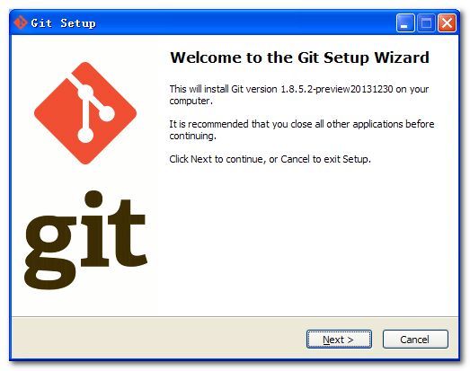

## 一、**Git教程**

### 1、**简介**

Git是一个开源的分布式版本控制系统，用于敏捷高效地处理任何或小或大的项目。

Git 是 Linus Torvalds 为了帮助管理 Linux 内核开发而开发的一个开放源码的版本控制软件。

Git 与常用的版本控制工具 CVS, Subversion 等不同，它采用了分布式版本库的方式，不必服务器端软件支持。

### 2、**Git和SVN区别**

GIT不仅仅是个版本控制系统，它也是个内容管理系统(CMS),工作管理系统等。

如果你是一个具有使用SVN背景的人，你需要做一定的思想转换，来适应GIT提供的一些概念和特征。

Git 与 SVN 区别点：

①　GIT是分布式的，SVN不是：这是GIT和其它非分布式的版本控制系统，例如SVN，CVS等，最核心的区别。

②　GIT把内容按元数据方式存储，而SVN是按文件：所有的资源控制系统都是把文件的元信息隐藏在一个类似.svn,.cvs等的文件夹里。

③　GIT分支和SVN的分支不同：分支在SVN中一点不特别，就是版本库中的另外的一个目录。

④　GIT没有一个全局的版本号，而SVN有：目前为止这是跟SVN相比GIT缺少的最大的一个特征。

⑤　GIT的内容完整性要优于SVN：GIT的内容存储使用的是SHA-1哈希算法。这能确保代码内容的完整性，确保在遇到磁盘故障和网络问题时降低对版本库的破坏。

### 3、**Git快速入门**

[Git简明指南](http://www.runoob.com/manual/git-guide/)：http://www.bootcss.com/p/git-guide/ 

入门后建议通过本站详细学习 Git 教程。

Git 完整命令手册地址：[http://git-scm.com/docs](http://git-scm.com/docs)

PDF 版命令手册：[github-git-cheat-sheet.pdf](http://www.runoob.com/manual/github-git-cheat-sheet.pdf)

## 二、**Git安装配置**

在使用Git前我们需要先安装 Git。Git 目前支持 Linux/Unix、Solaris、Mac和 Windows 平台上运行。

Git 各平台安装包下载地址为：[http://git-scm.com/downloads](http://git-scm.com/downloads)

### 1、**Linux 平台上安装**

Git 的工作需要调用 curl，zlib，openssl，expat，libiconv 等库的代码，所以需要先安装这些依赖工具。

在有 yum 的系统上（比如 Fedora）或者有 apt-get 的系统上（比如 Debian 体系），可以用下面的命令安装：

各 Linux 系统可以很简单多使用其安装包管理工具进行安装：

①　Debian/Ubuntu Git 安装命令为：

$ apt-get install libcurl4-gnutls-dev libexpat1-dev gettext   libz-dev libssl-dev

$ apt-get install git-core

$ git --version

git version 1.8.1.2

②　Centos/RedHat 安装命令为：

$ yum install curl-devel expat-devel gettext-devel  openssl-devel zlib-devel

$ yum -y install git-core

$ git --version

git version 1.7.1

### 2、**Windows 平台上安装**

在 Windows 平台上安装 Git 同样轻松，有个叫做 msysGit 的项目提供了安装包，可以到 GitHub 的页面上下载 exe 安装文件并运行：

安装包下载地址：[http://msysgit.github.io/](http://msysgit.github.io/)

完成安装之后，就可以使用命令行的 git 工具（已经自带了 ssh 客户端）了，另外还有一个图形界面的 Git 项目管理工具。

在开始菜单里找到"Git"->"Git Bash"，会弹出 Git 命令窗口，你可以在该窗口进行 Git 操作。

### 3、**Git 配置**

Git 提供了一个叫做 git config 的工具，专门用来配置或读取相应的工作环境变量。

这些环境变量，决定了 Git 在各个环节的具体工作方式和行为。这些变量可以存放在以下三个不同的地方：

l /etc/gitconfig 文件：系统中对所有用户都普遍适用的配置。若使用 git config 时用 --system 选项，读写的就是这个文件。

l ~/.gitconfig 文件：用户目录下的配置文件只适用于该用户。若使用 git config 时用 --global 选项，读写的就是这个文件。

l 当前项目的 Git 目录中的配置文件（也就是工作目录中的 .git/config 文件）：这里的配置仅仅针对当前项目有效。每一个级别的配置都会覆盖上层的相同配置，所以 .git/config 里的配置会覆盖 /etc/gitconfig 中的同名变量。

在 Windows 系统上，Git 会找寻用户主目录下的 .gitconfig 文件。主目录即 $HOME 变量指定的目录，一般都是 C:\\Documents and Settings\\$USER。

此外，Git 还会尝试找寻 /etc/gitconfig 文件，只不过看当初 Git 装在什么目录，就以此作为根目录来定位。

①　用户信息

配置个人的用户名称和电子邮件地址：

$ git config --global user.name "zhaofs1126"

$ git config --global user.email zhaofs1126@163.com

如果用了 --global 选项，那么更改的配置文件就是位于你用户主目录下的那个，以后你所有的项目都会默认使用这里配置的用户信息。

如果要在某个特定的项目中使用其他名字或者电邮，只要去掉 --global 选项重新配置即可，新的设定保存在当前项目的 .git/config 文件里。

②　文本编辑器

设置Git默认使用的文本编辑器, 一般可能会是 Vi 或者 Vim。如果你有其他偏好，比如 Emacs 的话，可以重新设置：

$ git config --global core.editor vim

③　差异分析工具

还有一个比较常用的是，在解决合并冲突时使用哪种差异分析工具。比如要改用 vimdiff 的话：

$ git config --global merge.tool vimdiff

Git 可以理解 kdiff3，tkdiff，meld，xxdiff，emerge，vimdiff，gvimdiff，ecmerge，和 opendiff 等合并工具的输出信息。

④　查看配置信息

要检查已有的配置信息，可以使用 git config --list 命令：

$ git config --list

user.name=zhaofs1126

user.email=zhaofs1126@163.com

有时候会看到重复的变量名，那就说明它们来自不同的配置文件（比如 /etc/gitconfig 和 ~/.gitconfig），不过最终 Git 实际采用的是最后一个。

这些配置我们也可以在 ~/.gitconfig 或 /etc/gitconfig 看到，如下所示：

vim ~/.gitconfig 

显示内容如下所示：

\[http\]

    postBuffer = 2M\[user\]

    name = zhaofs1126

    email = zhaofs1126@163.com

也可以直接查阅某个环境变量的设定，只要把特定的名字跟在后面即可，像这样：

$ git config user.name

zhaofs1126

## 三、**Git工作流程**

Git一般工作流程如下：

①　克隆 Git 资源作为工作目录。

②　在克隆的资源上添加或修改文件。

③　如果其他人修改了，你可以更新资源。

④　在提交前查看修改。

⑤　提交修改。

⑥　在修改完成后，如果发现错误，可以撤回提交并再次修改并提交。

下图展示了 Git 的工作流程：

## 四、**Git工作区、暂存区、版本库**

### 1、**基本概念**

我们先来理解下Git 工作区、暂存区和版本库概念

工作区：就是你在电脑里能看到的目录。

暂存区：英文叫stage, 或index。一般存放在 ".git目录下" 下的index文件（.git/index）中，所以我们把暂存区有时也叫作索引（index）。

版本库：工作区有一个隐藏目录.git，这个不算工作区，而是Git的版本库。

下面这个图展示了工作区、版本库中的暂存区和版本库之间的关系：

图中左侧为工作区，右侧为版本库。在版本库中标记为 "index" 的区域是暂存区（stage, index），标记为 "master" 的是 master 分支所代表的目录树。

图中我们可以看出此时 "HEAD" 实际是指向 master 分支的一个"游标"。所以图示的命令中出现 HEAD 的地方可以用 master 来替换。

图中的 objects 标识的区域为 Git 的对象库，实际位于 ".git/objects" 目录下，里面包含了创建的各种对象及内容。

当对工作区修改（或新增）的文件执行 "git add" 命令时，暂存区的目录树被更新，同时工作区修改（或新增）的文件内容被写入到对象库中的一个新的对象中，而该对象的ID被记录在暂存区的文件索引中。

当执行提交操作（git commit）时，暂存区的目录树写到版本库（对象库）中，master 分支会做相应的更新。即 master 指向的目录树就是提交时暂存区的目录树。

当执行 "git reset HEAD" 命令时，暂存区的目录树会被重写，被 master 分支指向的目录树所替换，但是工作区不受影响。

当执行 "git rm --cached <file>" 命令时，会直接从暂存区删除文件，工作区则不做出改变。

当执行 "git checkout ." 或者 "git checkout -- <file>" 命令时，会用暂存区全部或指定的文件替换工作区的文件。这个操作很危险，会清除工作区中未添加到暂存区的改动。

当执行 "git checkout HEAD ." 或者 "git checkout HEAD <file>" 命令时，会用 HEAD 指向的 master 分支中的全部或者部分文件替换暂存区和以及工作区中的文件。这个命令也是极具危险性的，因为不但会清除工作区中未提交的改动，也会清除暂存区中未提交的改动。

## 五、**Git创建仓库**

你可以使用一个已经存在的目录作为Git仓库。

### 1、**git init**

Git 使用 **git init** 命令来初始化一个 Git 仓库，Git 的很多命令都需要在 Git 的仓库中运行，所以 **git init** 是使用 Git 的第一个命令。

在执行完成 **git init** 命令后，Git 仓库会生成一个 .git 目录，该目录包含了资源的所有元数据，其他的项目目录保持不变（不像 SVN 会在每个子目录生成 .svn 目录，Git 只在仓库的根目录生成 .git 目录）。

**使用方法**

使用当前目录作为Git仓库，我们只需使它初始化。

git init

该命令执行完后会在当前目录生成一个 .git 目录。

使用我们指定目录作为Git仓库。

git init newrepo

初始化后，会在 newrepo 目录下会出现一个名为 .git 的目录，所有 Git 需要的数据和资源都存放在这个目录中。

如果当前目录下有几个文件想要纳入版本控制，需要先用 git add 命令告诉 Git 开始对这些文件进行跟踪，然后提交：

$ git add *.c

$ git add README

$ git commit -m '初始化项目版本'

以上命令将目录下以 .c 结尾及 README 文件提交到仓库中。

### 2、**git clone**

我们使用 **git clone** 从现有 Git 仓库中拷贝项目（类似 **svn checkout**）。

克隆仓库的命令格式为：

git clone <repo>

如果我们需要克隆到指定的目录，可以使用以下命令格式：

git clone <repo> <directory>

**参数说明**

l repo:Git 仓库。

l directory:本地目录。

比如，要克隆 Git项目的 Git 代码仓库 git，可以用下面的命令：

$ git clone git@github.com:git/git.git

执行该命令后，会在当前目录下创建一个名为git的目录，其中包含一个 .git 的目录，用于保存下载下来的所有版本记录。

如果要自己定义要新建的项目目录名称，可以在上面的命令末尾指定新的名字：

$ git clone git@github.com:git/git.git mygit

## 六、**Git基本操作**

Git 的工作就是创建和保存你项目的快照及与之后的快照进行对比。将对有关创建与提交你的项目快照的命令作介绍。

### 1、**git init**

用 git init 在目录中创建新的 Git 仓库。 你可以在任何时候、任何目录中这么做，完全是本地化的。

在目录中执行 git init，就可以创建一个 Git 仓库了。比如我们创建 zhaofusen 项目：

$ mkdir zhaofusen

$ cd zhaofusen/

$ git initInitialized empty Git repository in /Users/tianqixin/project/zhaofusen/.git/# 在 /project/zhaofusen/.git/ 目录初始化空 Git 仓库完毕。

现在你可以看到在你的项目中生成了 .git 这个子目录。 这就是你的 Git 仓库了，所有有关你的此项目的快照数据都存放在这里。

ls -a. .. .git

### 2、**git clone**

使用 git clone 拷贝一个 Git 仓库到本地，让自己能够查看该项目，或者进行修改。

如果你需要与他人合作一个项目，或者想要复制一个项目，看看代码，你就可以克隆那个项目。 执行命令：

 git clone \[url\]

\[url\] 为你想要复制的项目，就可以了。

例如我们克隆 Github 上的项目：

$ git clone git@github.com:schacon/simplegit.gitCloning into 'simplegit'...

remote: Counting objects: 13, done.

remote: Total 13 (delta 0), reused 0 (delta 0), pack-reused 13Receiving objects: 100% (13/13), done.Resolving deltas: 100% (2/2), done.Checking connectivity... done.

克隆完成后，在当前目录下会生成一个 simplegit 目录：

$ cd simplegit/ $ ls README Rakefile lib

上述操作将复制该项目的全部记录。

$ ls -a.        ..       .git     README   Rakefile lib

$ cd .git

$ ls

HEAD        description info        packed-refs

branches    hooks       logs        refs

config      index       objects

默认情况下，Git 会按照你提供的 URL 所指示的项目的名称创建你的本地项目目录。 通常就是该 URL 最后一个 / 之后的项目名称。如果你想要一个不一样的名字， 你可以在该命令后加上你想要的名称。

### 3、**git add**

git add 命令可将该文件添加到缓存，如我们添加以下两个文件：

$ touch README

$ touch hello.php

$ ls

README hello.php

$ git status -s?? README?? hello.php

$ 

git status 命令用于查看项目的当前状态。

接下来我们执行 git add 命令来添加文件：

$ git add README hello.php 

现在我们再执行 git status，就可以看到这两个文件已经加上去了。

$ git status -s

A  README

A  hello.php

$ 

新项目中，添加所有文件很普遍，我们可以使用 git add . 命令来添加当前项目的所有文件。

现在我们修改 README 文件：

$ vim README

在 README 添加以下内容：# zhaofusen Git 测试，然后保存退出。

再执行一下 git status：

$ git status -s

AM README

A  hello.php

"AM" 状态的意思是，这个文件在我们将它添加到缓存之后又有改动。改动后我们在执行 git add 命令将其添加到缓存中：

$ git add .

$ git status -s

A  README

A  hello.php

当你要将你的修改包含在即将提交的快照里的时候，需要执行 git add。

### 4、**git status**

git status 以查看在你上次提交之后是否有修改。

我演示该命令的时候加了 -s 参数，以获得简短的结果输出。如果没加该参数会详细输出内容：

$ git statusOn branch master

Initial commit

Changes to be committed:

  (use "git rm --cached <file>..." to unstage)

new file:   README

new file:   hello.php

### 5、**git diff**

执行 git diff 来查看执行 git status 的结果的详细信息。

git diff 命令显示已写入缓存与已修改但尚未写入缓存的改动的区别。git diff 有两个主要的应用场景。

l 尚未缓存的改动：git diff

l 查看已缓存的改动： git diff --cached

l 查看已缓存的与未缓存的所有改动：git diff HEAD

l 显示摘要而非整个 diff：git diff --stat

在 hello.php 文件中输入以下内容：

<?php

Phpinfo() ;

?>

$ git status -s

A  README

AM hello.php

$ git diff

diff --git a/hello.php b/hello.php

index e69de29..69b5711 100644

--- a/hello.php

+++ b/hello.php

@@ -0,0 +1,3 @@

+<?php

+phpinfo();

+?>

git status 显示你上次提交更新后的更改或者写入缓存的改动， 而 git diff 一行一行地显示这些改动具体是啥。

接下来我们来查看下 git diff --cached 的执行效果：

$ git add hello.php 

$ git status -s

A  README

A  hello.php

$ git diff --cached

diff --git a/README b/README

new file mode 100644

index 0000000..8f87495

--- /dev/null

+++ b/README

@@ -0,0 +1 @@

+# zhaofusen Git 测试

diff --git a/hello.php b/hello.php

new file mode 100644

index 0000000..69b5711

--- /dev/null

+++ b/hello.php

@@ -0,0 +1,3 @@

+<?php

++phpinfo();

+?>

### 6、**git commit**

使用 git add 命令将想要快照的内容写入缓存区， 而执行 git commit 将缓存区内容添加到仓库中。

Git 为你的每一个提交都记录你的名字与电子邮箱地址，所以第一步需要配置用户名和邮箱地址。

$ git config --global user.name 'zhaofs1126'

$ git config --global user.email zhaofs1126@zhaofusen.com

接下来我们写入缓存，并提交对 hello.php 的所有改动。在首个例子中，我们使用 -m 选项以在命令行中提供提交注释。

$ git add hello.php

$ git status -s

A  README

A  hello.php

$ $ git commit -m '第一次版本提交'

\[master (root-commit) d32cf1f\] 第一次版本提交

 2 files changed, 4 insertions(+)

 create mode 100644 README

 create mode 100644 hello.php

现在我们已经记录了快照。如果我们再执行 git status:

$ git status# On branch master

nothing to commit (working directory clean)

以上输出说明我们在最近一次提交之后，没有做任何改动，是一个"working directory clean：干净的工作目录"。

如果你没有设置 -m 选项，Git 会尝试为你打开一个编辑器以填写提交信息。 如果 Git 在你对它的配置中找不到相关信息，默认会打开 vim。屏幕会像这样：

# Please enter the commit message for your changes. Lines starting

# with '#' will be ignored, and an empty message aborts the commit.

# On branch master

# Changes to be committed:

#   (use "git reset HEAD <file>..." to unstage)

#

# modified:   hello.php

#

~

~

".git/COMMIT_EDITMSG" 9L, 257C

如果你觉得 git add 提交缓存的流程太过繁琐，Git 也允许你用 -a 选项跳过这一步。命令格式如下：

git commit -a

我们先修改 hello.php 文件为以下内容：

<?php

Phpinfo()

echo 'zhaofusen Git Test';

?>

再执行以下命令：

git commit -am '修改 hello.php 文件'

\[master 71ee2cb\] 修改 hello.php 文件

 1 file changed, 1 insertion(+)

### 7、**git reset HEAD**

git reset HEAD 命令用于取消已缓存的内容。

我们先改动文件 README 文件，内容如下：

# zhaofusen Git 测试# 暮雨森

hello.php 文件修改为：

<?php

Phpinfo()

echo 'zhaofusen Git Test';

echo 'zhaofusen Git Test';

?>

现在两个文件修改后，都提交到了缓存区，我们现在要取消其中一个的缓存，操作如下：

$ git status -s

 M README

 M hello.php

$ git add .

$ git status -s

M  README

M  hello.pp

$ git reset HEAD -- hello.php Unstaged changes after reset:

M hello.php

$ git status -s

M  README

 M hello.php

现在你执行 git commit，只会将 README 文件的改动提交，而 hello.php 是没有的。

$ git commit -m '修改'\[master f50cfda\] 修改

 1 file changed, 1 insertion(+)

$ git status -s

 M hello.php

可以看到 hello.php 文件的修改并为提交。

这时我们可以使用以下命令将 hello.php 的修改提交：

$ git commit -am '修改 hello.php 文件'

\[master 760f74d\] 修改 hello.php 文件

 1 file changed, 1 insertion(+)

$ git status

On branch master

nothing to commit, working directory clean

简而言之，执行 git reset HEAD 以取消之前 git add 添加，但不希望包含在下一提交快照中的缓存。

### 8、**git rm**

git rm 会将条目从缓存区中移除。这与 git reset HEAD 将条目取消缓存是有区别的。 "取消缓存"的意思就是将缓存区恢复为我们做出修改之前的样子。

默认情况下，git rm file 会将文件从缓存区和你的硬盘中（工作目录）删除。

如果你要在工作目录中留着该文件，可以使用 git rm --cached：

如我们删除 hello.php文件：

$ git rm hello.php 

rm 'hello.php'

$ ls

README

不从工作区中删除文件：

$ git rm --cached README 

rm 'README'

$ ls

README

### 9、**git mv**

git mv 命令做得所有事情就是 git rm --cached 命令的操作， 重命名磁盘上的文件，然后再执行 git add 把新文件添加到缓存区。

我们先把刚移除的 README 添加回来：

$ git add README 

然后对其重名:

$ git mv README  README.md

$ ls

README.md

## 七、**Git分支管理**

几乎每一种版本控制系统都以某种形式支持分支。使用分支意味着你可以从开发主线上分离开来，然后在不影响主线的同时继续工作。

有人把 Git 的分支模型称为"必杀技特性"，而正是因为它，将 Git 从版本控制系统家族里区分出来。

创建分支命令：

git branch (branchname)

切换分支命令:

git checkout (branchname)

当你切换分支的时候，Git 会用该分支的最后提交的快照替换你的工作目录的内容， 所以多个分支不需要多个目录。

合并分支命令:

git merge 

你可以多次合并到统一分支， 也可以选择在合并之后直接删除被并入的分支。

### 1、**列出分支**

列出分支基本命令：

git branch

没有参数时，git branch 会列出你在本地的分支。

$ git branch* master

此例的意思就是，我们有一个叫做"master"的分支，并且该分支是当前分支。

当你执行 git init 的时候，缺省情况下 Git 就会为你创建"master"分支。

如果我们要手动创建一个分支。执行 git branch (branchname) 即可。

$ git branch testing

$ git branch* master

  testing

现在我们可以看到，有了一个新分支 testing。

当你以此方式在上次提交更新之后创建了新分支，如果后来又有更新提交， 然后又切换到了"testing"分支，Git 将还原你的工作目录到你创建分支时候的样子

接下来我们将演示如何切换分支，我们用 git checkout (branch) 切换到我们要修改的分支。

$ ls

README

$ echo 'zhaofusen.com' > test.txt

$ git add .

$ git commit -m 'add test.txt'

\[master 048598f\] add test.txt

 2 files changed, 1 insertion(+), 3 deletions(-)

 delete mode 100644 hello.php

 create mode 100644 test.txt

$ ls

README test.txt

$ git checkout testing

Switched to branch 'testing'

$ ls

README hello.php

当我们切换到"testing"分支的时候，我们添加的新文件test.txt被移除了, 原来被删除的文件hello.php文件又出现了。切换回"master"分支的时候，它们有重新出现了。

$ git checkout master

Switched to branch 'master'

$ ls

README test.txt

我们也可以使用 git checkout -b (branchname) 命令来创建新分支并立即切换到该分支下，从而在该分支中操作。

$ git checkout -b newtest

Switched to a new branch 'newtest'

$ git rm test2.txt 

rm 'test2.txt'

$ ls

README test.txt

$ git commit -am 'removed test2.txt'

\[newtest 556f0a0\] removed test2.txt

 1 file changed, 1 deletion(-)

 delete mode 100644 test2.txt

$ git checkout master

Switched to branch 'master'

$ ls

README test.txt test2.txt

如你所见，我们创建了一个分支，在该分支的上下文中移除了一些文件，然后切换回我们的主分支，那些文件又回来了。

使用分支将工作切分开来，从而让我们能够在不同上下文中做事，并来回切换。

### 2、**删除分支**

删除分支命令：

git branch -d (branchname)

例如我们要删除"testing"分支：

$ git branch* master

  testing

$ git branch -d testing

Deleted branch testing (was 85fc7e7).

$ git branch* master

### 3、**分支合并**

一旦某分支有了独立内容，你终究会希望将它合并回到你的主分支。 你可以使用以下命令将任何分支合并到当前分支中去：

git merge

$ git branch* master

  newtest

$ ls

README test.txt test2.txt

$ git merge newtest

Updating 2e082b7..556f0a0

Fast-forward

 test2.txt | 1 -

 1 file changed, 1 deletion(-)

 delete mode 100644 test2.txt

$ ls

README test.txt

以上实例中我们将 newtest 分支合并到主分支去，test2.txt 文件被删除。

### 4、**合并冲突**

合并并不仅仅是简单的文件添加、移除的操作，Git 也会合并修改。

$ git branch* master

$ cat test.txt

163.com

首先，我们创建一个叫做"change_site"的分支，切换过去，我们将内容改为 www.zhaofusen.com 。

$ git checkout -b change_site

Switched to a new branch 'change_site'

$ vim test.txt 

$ head -1 test.txt 

www.zhaofusen.com

$ git commit -am 'changed the site'

\[change_site d7e7346\] changed the site

 1 file changed, 1 insertion(+), 1 deletion(-)

将修改的内容提交到 "change_site" 分支中。 现在，假如切换回 "master" 分支我们可以看内容恢复到我们修改前的，我们再次修改test.txt文件。

$ git checkout master

Switched to branch 'master'

$ head -1 test.txt 

www.zhaofusen.com

$ vim test.txt 

$ cat test.txt

163.com

新增加一行

$ git diff

diff --git a/test.txt b/test.txt

index 704cce7..f84c2a4 100644

--- a/test.txt

+++ b/test.txt

@@ -1 +1,2 @@

163.com

+新增加一行

$ git commit -am '新增加一行'

\[master 14b4dca\] 新增加一行

 1 file changed, 1 insertion(+) 

现在这些改变已经记录到我的 "master" 分支了。接下来我们将 "change_site" 分支合并过来。

 $ git merge change_site

Auto-merging test.txt

CONFLICT (content): Merge conflict in test.txt

Automatic merge failed; fix conflicts and then commit the result.

$ cat test.txt 

<<<<<<< HEAD

163.com

新增加一行

=======

www.zhaofusen.com

>>>>>>> change_site

我们将前一个分支合并到 "master" 分支，一个合并冲突就出现了，接下来我们需要手动去修改它。

$ vim test.txt 

$ cat test.txt 

www.zhaofusen.com

新增加一行

$ git diff

diff --cc test.txt

index f84c2a4,bccb7c2..0000000

--- a/test.txt

+++ b/test.txt

@@@ -1,2 -1,1 +1,2 @@@

- 163.com

+ www.zhaofusen.com

 +新增加一行

在 Git 中，我们可以用 git add 要告诉 Git 文件冲突已经解决

$ git status -s

UU test.txt

$ git add test.txt 

$ git status -s

M  test.txt

$ git commit\[master 88afe0e\] Merge branch 'change_site'

现在我们成功解决了合并中的冲突，并提交了结果。

## 八、**Git查看提交历史**

在使用 Git 提交了若干更新之后，又或者克隆了某个项目，想回顾下提交历史，我们可以使用 git log 命令查看。

针对我们前一章节的操作，使用 git log 命令列出历史提交记录如下：

$ git log

commit 88afe0e02adcdfea6844bb627de97da21eb10af1

Merge: 14b4dca d7e7346

Author: zhaofusen [<zhaofs1126@163.com>](mailto:<w3c@w3cschool.cc>)

Date:   Sun Mar 1 15:03:42 2017 +0800

    Merge branch 'change_site' 

    Conflicts:

        test.txt

commit 14b4dcadbdc847207651d5a9fae0d315057f346e

Author: zhaofusen [<zhaofs1126@163.com>](mailto:<w3c@w3cschool.cc>)

Date:   Sun Mar 1 14:53:15 2017 +0800

    新增加一行

commit d7e734640da06055e107eaf29cf350b3f1de1c2c

Author: zhaofusen [<zhaofs1126@163.com>](mailto:<w3c@w3cschool.cc>)

Date:   Sun Mar 1 14:48:57 2017 +0800

    changed the site

commit 556f0a0637978097b82287ac665a717623b21f3f

Author: zhaofusen [<zhaofs1126@163.com>](mailto:<w3c@w3cschool.cc>)

Date:   Sun Mar 1 14:40:34 2017 +0800

    removed test2.txt

我们可以用 --oneline 选项来查看历史记录的简洁的版本。

$ git log --oneline

88afe0e Merge branch 'change_site'

14b4dca 新增加一行

d7e7346 changed the site

556f0a0 removed test2.txt

2e082b7 add test2.txt

048598f add test.txt

85fc7e7 test comment from zhaofusen.cc

这告诉我们的是，此项目的开发历史。

我们还可以用 --graph 选项，查看历史中什么时候出现了分支、合并。以下为相同的命令，开启了拓扑图选项：

$ git log --oneline --graph

*   88afe0e Merge branch 'change_site'

|\  

| * d7e7346 changed the site

* | 14b4dca 新增加一行

|/  

* 556f0a0 removed test2.txt

* 2e082b7 add test2.txt

* 048598f add test.txt

* 85fc7e7 test comment from zhaofusen.cc

现在我们可以更清楚明了地看到何时工作分叉、又何时归并。

你也可以用 '--reverse'参数来逆向显示所有日志。

$ git log --reverse --oneline

85fc7e7 test comment from zhaofusen.cc

048598f add test.txt

2e082b7 add test2.txt

556f0a0 removed test2.txt

d7e7346 changed the site

14b4dca 新增加一行

88afe0e Merge branch 'change_site'

如果只想查找指定用户的提交日志可以使用命令：git log --author , 例如，比方说我们要找 Git 源码中 Linus 提交的部分：

$ git log --author=Linus --oneline -5

81b50f3 Move 'builtin-*' into a 'builtin/' subdirectory

3bb7256 make "index-pack" a built-in

377d027 make "git pack-redundant" a built-in

b532581 make "git unpack-file" a built-in

112dd51 make "mktag" a built-in

如果你要指定日期，可以执行几个选项：--since 和 --before，但是你也可以用 --until 和 --after。

例如，如果我要看 Git 项目中三周前且在四月十八日之后的所有提交，我可以执行这个（我还用了 --no-merges 选项以隐藏合并提交）：

$ git log --oneline --before={3.weeks.ago} --after={2017-04-18} --no-merges

5469e2d Git 1.7.1-rc2

d43427d Documentation/remote-helpers: Fix typos and improve language

272a36b Fixup: Second argument may be any arbitrary string

b6c8d2d Documentation/remote-helpers: Add invocation section

5ce4f4e Documentation/urls: Rewrite to accomodate transport::address

00b84e9 Documentation/remote-helpers: Rewrite description

03aa87e Documentation: Describe other situations where -z affects git diff

77bc694 rebase-interactive: silence warning when no commits rewritten

636db2c t3301: add tests to use --format="%N"

## 九、**Git标签**

如果你达到一个重要的阶段，并希望永远记住那个特别的提交快照，你可以使用 git tag 给它打上标签。

比如说，我们想为我们的 zhaofusencc 项目发布一个"1.0"版本。 我们可以用 git tag -a v1.0 命令给最新一次提交打上（HEAD）"v1.0"的标签。

-a 选项意为"创建一个带注解的标签"。 不用 -a 选项也可以执行的，但它不会记录这标签是啥时候打的，谁打的，也不会让你添加个标签的注解。 我推荐一直创建带注解的标签。

$ git tag -a v1.0 

当你执行 git tag -a 命令时，Git 会打开你的编辑器，让你写一句标签注解，就像你给提交写注解一样。

现在，注意当我们执行 git log --decorate 时，我们可以看到我们的标签了：

$ git log --oneline --decorate --graph

*   88afe0e (HEAD, tag: v1.0, master) Merge branch 'change_site'

|\  

| * d7e7346 (change_site) changed the site

* | 14b4dca 新增加一行

|/  

* 556f0a0 removed test2.txt

* 2e082b7 add test2.txt

* 048598f add test.txt

* 85fc7e7 test comment from zhaofusen.cc

如果我们忘了给某个提交打标签，又将它发布了，我们可以给它追加标签。

例如，假设我们发布了提交 85fc7e7(上面实例最后一行)，但是那时候忘了给它打标签。 我们现在也可以：

$ git tag -a v0.9 85fc7e7

$ git log --oneline --decorate --graph

*   88afe0e (HEAD, tag: v1.0, master) Merge branch 'change_site'

|\  

| * d7e7346 (change_site) changed the site

* | 14b4dca 新增加一行

|/  

* 556f0a0 removed test2.txt

* 2e082b7 add test2.txt

* 048598f add test.txt

* 85fc7e7 (tag: v0.9) test comment from zhaofusen.cc

如果我们要查看所有标签可以使用以下命令：

$ git tag

v0.9

v1.0

指定标签信息命令：

git tag -a <tagname> -m "zhaofusen.cc标签"