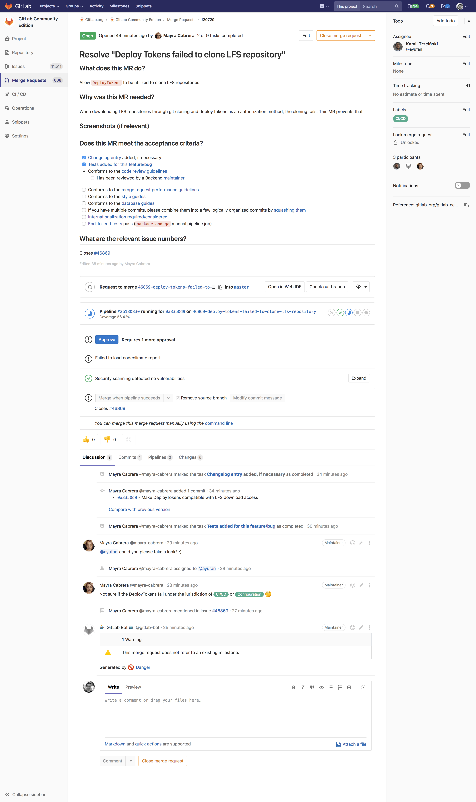
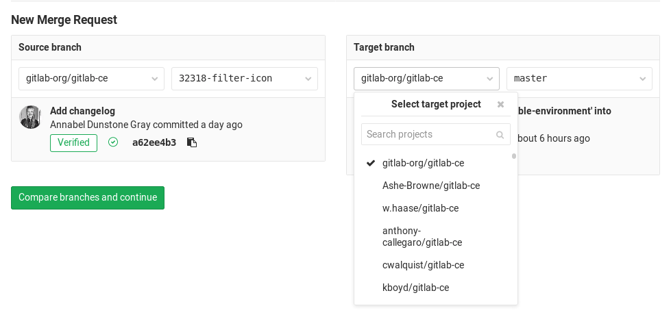
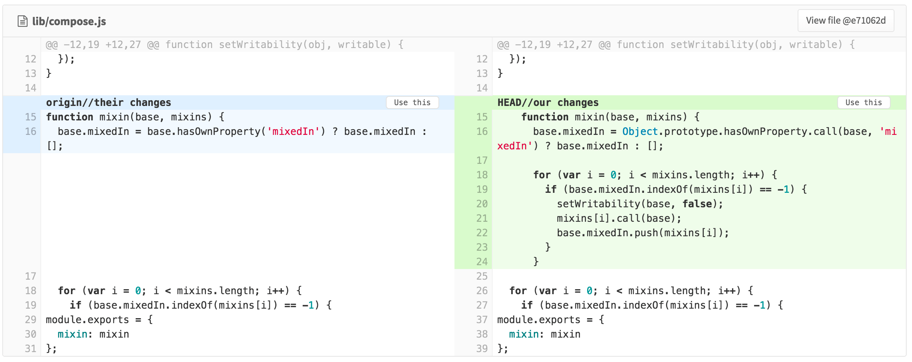

# Merge requests

参考：
+ https://docs.gitlab.com/ee/gitlab-basics/add-merge-request.html
+ https://docs.gitlab.com/ee/user/project/merge_requests/index.html
+ https://docs.gitlab.com/ee/user/project/merge_requests/resolve_conflicts.html

## Overview

MergeRequest(`MR`)是Gitlab作为代码协作和版本控制平台的一个基本特性。简单的描述就是：a request to merge one branch into another.

通过Gitlab的Merge Request我们可以做什么：
+ 比较两条分支的代码改动
+ 代码review
+ 对临时分支进行预编译、测试、部署
+ 在UI上解决merge 冲突

## 使用场景

+ checkout一个分支，以merge request的方式提交代码
+ 搜集团队中其他人的反馈
+ Verify change
+ Your manager pushes a commit with his final review, approves the merge request。

## 如何创建一个MergeRequest

+ 在开始之前，需要保证你已经在Gitlab上建好分支，并且改动已经提交到了这个分支上面。
+ 找到你要进行merge request的project，点击`Merge request`tab
+ 点击右上方的`New merge request`
+ 在这个页面选择源分支（source branch）和目标分支（TargetBranch），比如我们的FeatureBranch就是source branch，master和develop就是targetbranch。

+ 分支选择好了之后，点击`Compare branches and continue` 按钮。
+ 然后，给merge request 添加标题和描述。并且选择由谁来review 这merge request。

 + 最后，点击`Submit merge request`按钮，提交merge Request。

 ## 解决Merge Request冲突

 当两条分支的改动差异比较大，或者改动了相同文件的相同内容。这个时候就会产生merge 冲突。

 Git在一定成都上可以自己解决冲突，但是还是有一部分冲突，需要我们手动解决。
 而当冲突没解完时，Gitlab是不会让我们把代码合进去的。

 

 使用Gitlab的在线编辑器进行冲突解决。

 ### Resolve conflicts: interactive mode

 

 ### Resolve conflicts: inline editor

 
