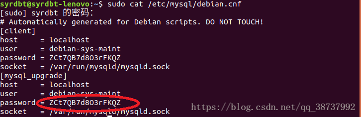
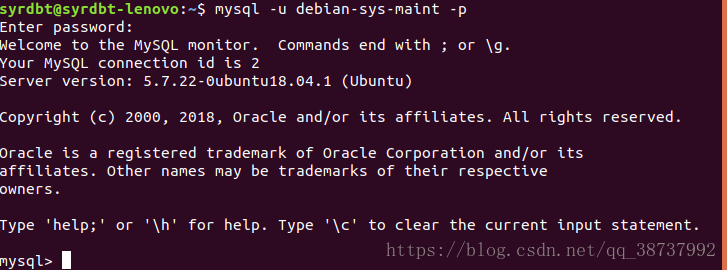
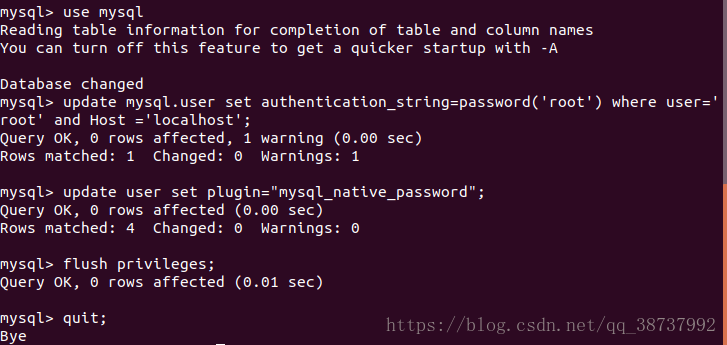
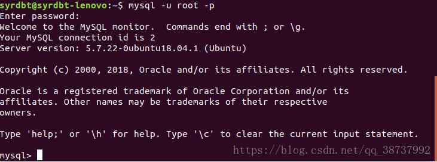

# ubuntu18.04 首次登录mysql未设置密码或忘记密码解决方法

## 首先输入以下指令：

```
sudo cat /etc/mysql/debian.cnf
```



## 再输入以下指令

```
mysql -u debian-sys-maint -p
//注意! 
//这条指令的密码输入是输入第一条指令获得的信息中的 password = ZCt7QB7d8O3rFKQZ 得来。
//请根据自己的实际情况填写！
```

运行截图如下：(注意! 这步的密码输入的是 ZCt7QB7d8O3rFKQZ，密码是由第一条指令获得的信息中的

password = ZCt7QB7d8O3rFKQZ 得来，每个人不一样，请根据自己的实际情况输入，输入就可以得到以下运行情况）



## 修改密码，本篇文章将密码修改成 root , 用户可自行定义。

```
    use mysql;
    // 下面这句命令有点长，请注意。
    update mysql.user set authentication_string=password('root') where user='root' and Host ='localhost';
    update user set plugin="mysql_native_password"; 
    flush privileges;
    quit;
```



## 重新启动mysql:

```
    sudo service mysql restart
    mysql -u root -p // 启动后输入已经修改好的密码：root
```


