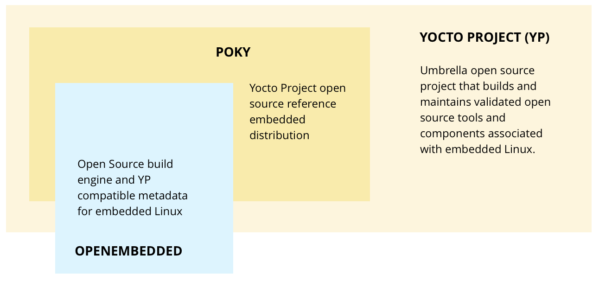
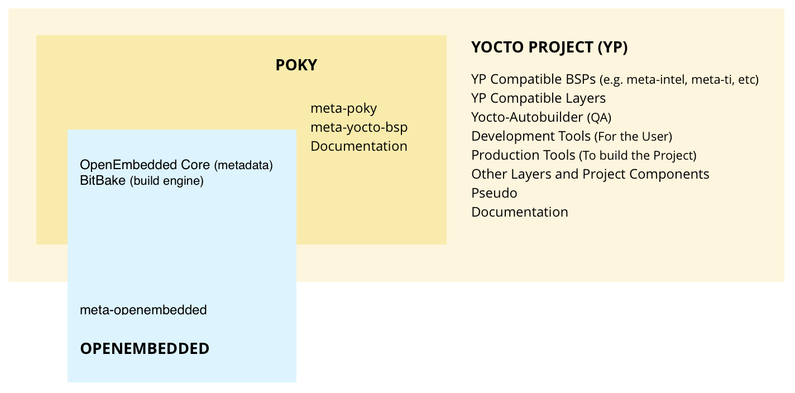
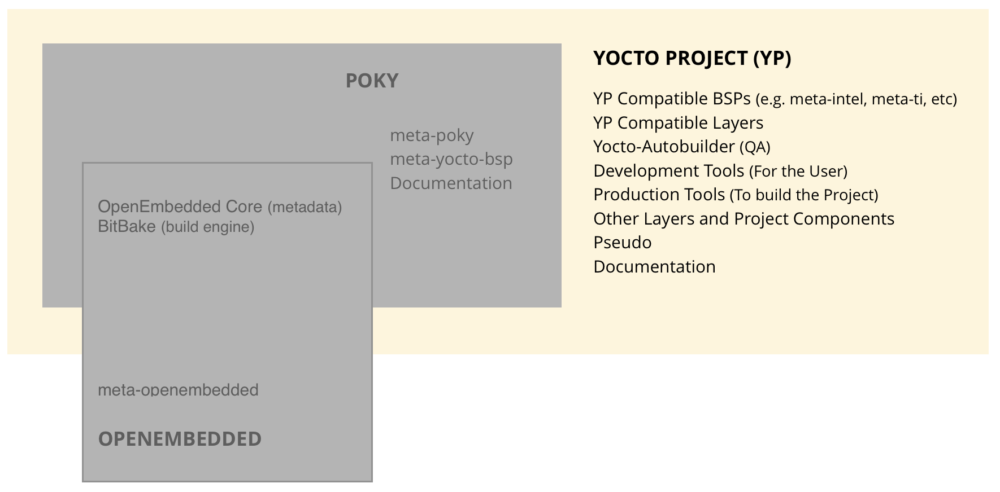
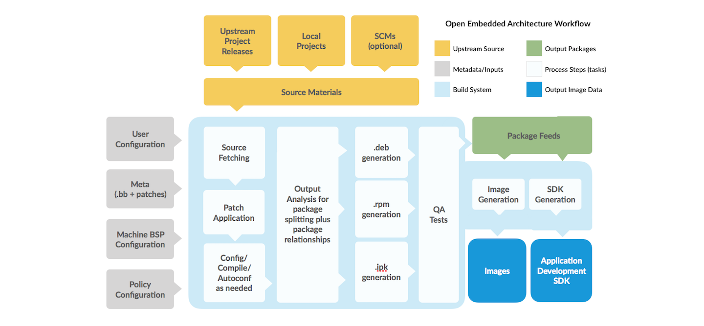
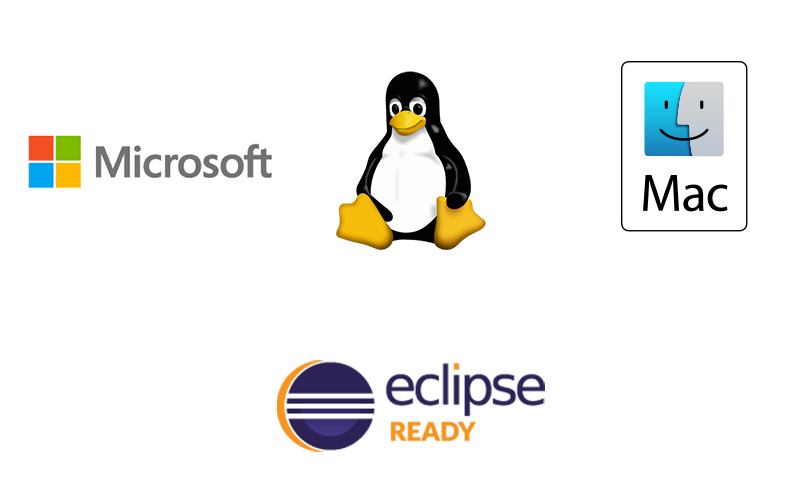
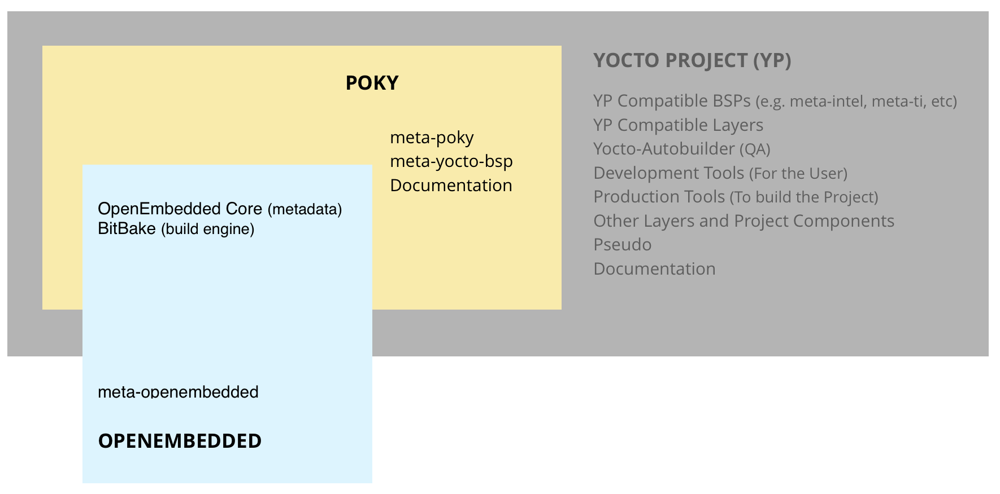

# Yocto Project Software Overview

## Getting Started: The Yocto Project® Overview

Yocto项目是一个开源协作项目，可帮助开发人员为嵌入式产品创建定制的基于Linux的系统，而不管硬件架构如何。 该项目提供了一套灵活的工具和一个空间，全世界的嵌入式开发人员可以共享可用于为嵌入式设备创建量身定制的Linux映像的技术，软件堆栈，配置和最佳实践。

The project provides a flexible set of tools and a space where embedded developers worldwide can share technologies, software stacks, configurations and best practices which can be used to create tailored Linux images for embedded devices.

该项目提供了提供硬件支持和软件堆栈的标准，允许交换软件配置和构建。 这些工具允许用户以可维护和可扩展的方式构建和支持多个硬件平台和软件栈的定制。

从历史上看，这个项目是从OpenEmbedded Project开始的，并且与OpenEmbedded Project一起工作，这是构建系统和一些元数据的基础。

Yocto项目结合，维护和验证三（3）个关键开发元素。

1. 一套用于使嵌入式Linux成功工作的集成工具，包括用于自动化构建和测试的工具，用于板级支持和许可证合规性的工艺以及用于定制基于Linux的嵌入式操作系统的组件信息
2. 一个参考嵌入式发行版（称为Poky）
3. OpenEmbedded构建系统与[OpenEmbedded Project](https://www.openembedded.org/wiki/Main_Page)共同维护

Yocto项目中有许多不同的开源组件和工具。

Poky(参考嵌入式操作系统实际上)是一个可行的构建示例，它使用包含的构建系统（BitBake，构建引擎和OpenEmbedded-Core，核心构建系统元数据）构建一个小型嵌入式操作系统。

Yocto项目中有许多不同的开源组件和工具。

Poky，参考嵌入式操作系统实际上是一个可行的构建示例，它将使用包含的构建系统（BitBake，构建引擎和OpenEmbedded-Core，核心构建系统元数据）构建一个小型嵌入式操作系统。

构建系统使用Poky构建指令“文件”（称为配方recipes和层layers（下面定义））下载。 您可以以任何您需要的方式修改，复制或使用Poky构建细节，以创建您的定制嵌入式Linux。

## The Layer Model - The Key to Customization

Yocto Project为嵌入式和物联网Linux创建提供了一种开发模式，可将其与其他简单构建系统区分开来。它被称为层模型(Layer Model)。

层模型(Layer Model)旨在同时支持协作和定制。图层(Layers)是包含相关指令集的存储库，这些指令告诉构建系统(build system)要做什么。用户可以协作，共享和重复使用图层。图层可以随时包含对之前指示或设置的更改。

这种强大的覆盖功能允许您定制以前的协作或社区提供的图层以满足您的产品要求。(This powerful override capability is what allows you to customize previous collaborative or community supplied layers to suit your product requirements.)

使用不同的图层来在逻辑上分离构建中的信息。例如，您可以拥有BSP图层，GUI图层，发行版配置，中间件或应用程序。将整个构建放在一个层中会限制未来的定制和重用。另一方面，将信息隔离为多个层次有助于简化未来的定制和重用。尽可能使用硅片供应商提供的BSP层。

熟悉策划（测试）[Yocto Project Compatible Layer Index](https://www.yoctoproject.org/software-overview/layers/) 。还有[OpenEmbedded layer index](http://layers.openembedded.org/layerindex/branch/master/layers/)，其中包含更多图层，但内容不太普遍验证。

(Familiarize yourself with the curated (tested) Yocto Project Compatible Layer Index . There is also the OpenEmbedded layer index which contains more layers but the content is less universally validated.)

## Components and Tools Maintained by the Yocto Project

有一些组件和工具的集合被项目用来维护和更新实际项目。 也有一些项目本身直接使用。 最后，开发人员使用其他组件和工具来创建自定义操作系统。 这些组件和工具本身就是开源项目或元数据。 两者都与参考分发和构建系统分开，大部分都是单独下载的。

[More About Components and Tools](https://www.yoctoproject.org/software-overview/project-components/)

## TERMS for Reference

1. **Configuration Files**: 保存变量的全局定义的文件，用户定义的变量和硬件配置信息。 他们告诉构建系统要构建什么并将其放入映像以支持特定的平台。

2. **Recipe**: 元数据的最常见形式(The most common form of metadata.)。 Recipe将一系列的设置和task（instructions）打包，用于构建二进制镜像。Recipe描述了您获取源代码的位置以及要应用的patch。 Recipes描述库或其他recipe的依赖关系，以及配置和编译选项。 它们存储在Layers中。

3. **Layer**: A collection of related recipes.图层允许您合并相关的元数据以自定义构建，并隔离多个构架构建的信息。 图层在覆盖先前规范的能力上是分层的。 您可以包含Yocto项目中的任意数量的可用图层，并通过添加图层来自定义构建。 Yocto项目中的图层索引是可搜索的。

4. **Metadata**: Yocto项目的一个关键元素是用于构建Linux发行版的元数据，在编译image时它包含在编译系统的解析文件中。一般而言，metadata包括recipe，配置文件和其他涉及构建指令本身的信息，以及用于控制构建内容并影响其构建方式的数据。 元数据还包括命令和数据，这些命令和数据用于指示使用什么版本的软件，以及从哪里获得软件，以及在特定情况下用于修复错误或自定义的软件本身（修补程序或辅助文件 patches or auxiliary files）的更改和软件。 OpenEmbedded Core是一组经过验证的元数据。

5. **OpenEmbedded-Core**: oe-core是由基础配方（foundation recipes），类和相关文件组成的元数据，这些文件在许多不同的OpenEmbedded衍生系统(derived systems)中都很常见，包括Yocto项目。 它是由OpenEmbedded社区开发的原始资源库的一个精心设计的子集，该资源库已经被细化为一个更小的、核心的持续验证配方集，从而产生严格控制和质量保证的核心配方集（core set of recipes）。

6. **Poky**: 一个参考嵌入式发行版和一个参考测试配置，
    1）提供了一个基本级别的功能发行版，可用于说明如何定制发行版，
    2）测试Yocto Project组件，Poky用于验证Yocto项目，
    3）作为用户下载Yocto项目的载体。
   Poky不是产品级的发行版，而是定制的一个很好的起点（a good starting point for customization）。 Poky是一个位于oe核心之上的集成层。

7. **Build System - "Bitbake"**: 用于分析指令（配方）和配置数据的调度程序和执行引擎。然后它创建一个依赖关系树来排序编译，调度包含的代码的编译，最后执行构建指定的自定义Linux image（发行版）。 BitBake是一个make-like工具。 BitBake recipes指定如何构建特定的包。 它们包括所有程序包依赖项，源代码位置，配置，编译，构建，安装和删除说明。 recipes还将元数据存储在标准变量的包中。 相关的recipes被合并到一个layer中。 在构建过程中跟踪依赖关系，并执行包的本地或交叉编译。 作为cross-build setup的第一步，框架将尝试创建适用于目标平台的交叉编译器工具链（Extensible SDK）。（As a first step in a cross-build setup, the framework will attempt to create a cross-compiler toolchain (Extensible SDK) suited for the target platform.）

8. **Packages**: 用于创建最终镜像的build system的输出。

9. **Extensible Software Development Kit (ESDK)**: 针对应用程序开发人员的定制SDK，允许他们将其库和编程更改合并到image中，以使其代码可供其他应用程序开发人员使用。

10. **Image**: A binary form of a Linux distribution (operating system) intended to be loaded onto a device.

## The General "Workflow" - How it All Works

[workflow video](https://youtu.be/-cXvE4VyyA8)

+ To begin, developers specify architecture, policies, patches and configuration details.(开始时，开发人员指定架构，策略，补丁和配置细节。)

+ The build system then fetches and downloads the source code from where ever specified. The project supports standard methods such as tarballs or source code repositories systems such as git.(然后构建系统从指定的地方获取并下载源代码。 该项目支持标准方法，如tarball或源代码仓库系统，如git。)

+ Once downloaded, the sources are extracted into a local work area where patches are applied and common steps for configuring and compiling the software will be run.（一旦下载完成，源代码将被解压到应用patch的本地工作区中，并且将运行用于配置和编译软件的常用步骤。）

+ The software is then installed into a temporary staging area where the binary package format you select (deb, rpm, or ipk) will be used to roll up the software.（然后将软件安装到暂存区，在该区域中使用您选择的二进制包格式（deb，rpm或ipk）来打包软件。）

+ Different QA and sanity checks are run throughout entire build process.（在整个构建过程中运行不同的质量安全和可用性检查。）

+ After the binaries are created, a binary package feed is generated which is then used to create the final root file image.（创建二进制文件之后，会生成一个二进制包，然后用它来创建最终的根文件映像（the final root file image）。）

+ The file system image is generated.（产生最终的images文件）

When using Yocto Project, this workflow will change depending on what components and tools are actually being used.（在使用Yocto Project时，此工作流程将根据实际使用的组件和工具而改变）

## Development Environment - Host Setup

1) Most developers use a Linux development host as described in the [Yocto Project Quick Build](https://www.yoctoproject.org/docs/).

2) For other operating systems, the Yocto Project provides CROPS, an open source, cross-platform development framework that leverages Docker containers. CROPS provides an easily managed, extensible environment allowing developers to build binaries for a variety of architectures on Windows or macOS in addition to native Linux hosts. For more information, see the Development Tasks Manual.(对于其他操作系统，Yocto项目提供CROPS，这是一个利用Docker容器的开源跨平台开发框架。 CROPS提供了一个易于管理和可扩展的环境，允许开发人员为本地Linux主机以外的各种Windows或MacOS体系结构构建二进制文件。 有关更多信息，请参阅开发任务手册。)

3) A third option is to use toaster, a web interface with useful but limited capability that allows you configure and run builds, and provides information and statistics about the build process. See the Toaster Manual.(第三个选择是使用toaster，这是一个有用但功能有限的Web界面，允许您配置和运行构建，并提供有关构建过程的信息和统计信息。 见Toaster机手册。)

Once your development host is set up to use the Yocto Project, the Eclipse IDE is also available for use.

## Reference Embedded Distribution (Poky)

“Poky”是Yocto Project的参考发行版或参考OS套件的名称。 它包含构建系统（BitBake和OpenEmbedded Core）以及一组元数据，以帮助您开始构建自己的发行版。

要使用Yocto Project工具，您可以下载Poky并使用它来引导(bootstrap)您自己的发行版。 请注意，Poky不包含二进制文件 - 这是一个如何从源代码构建自己的定制Linux发行版的工作示例。

[More About the Reference Distro](https://www.yoctoproject.org/software-overview/reference-distribution/)

## Yocto Project Features

除了固有的功能外，Yocto项目还具有项目功能，这些功能在一个版本中引入，并且通常在几个版本中扩展并完成。 有关这些功能的深入信息可以在与发行版和工具相关的“自述”文件中找到。 此区域提供了对3个最新版本和一般项目功能的功能更新的高级概述。

[High Level Feature Table](https://www.yoctoproject.org/software-overview/features/)